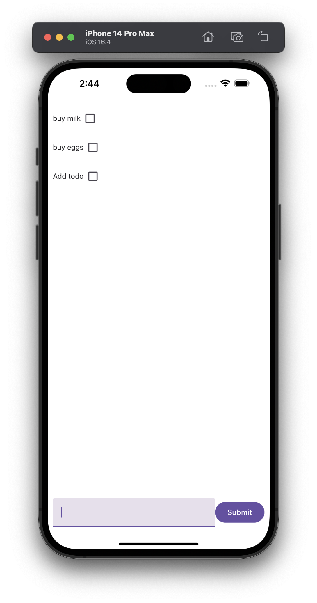
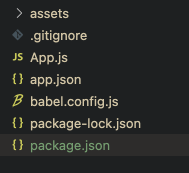
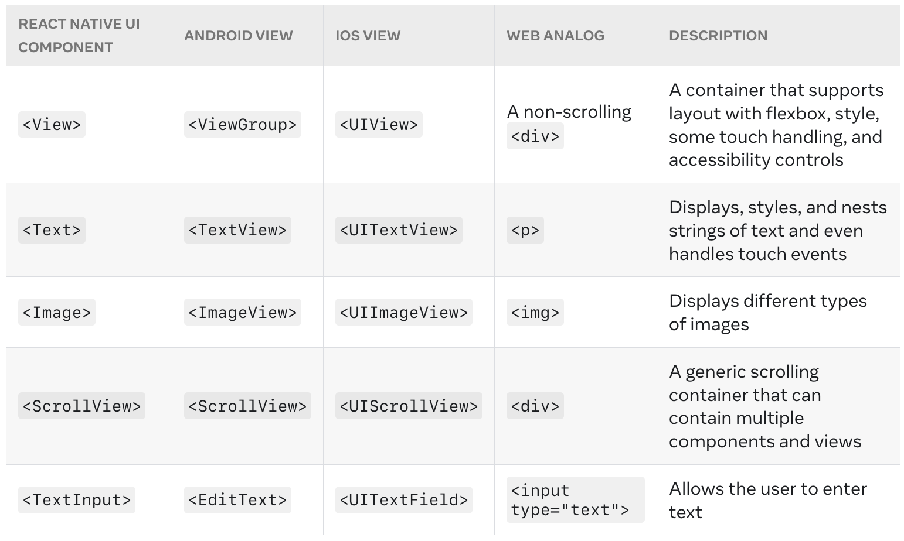

# React Native: Part 1

---
# About Me

- *Yadunand* Prem
- Y1 CS Student
- Coreteam Member of NUS Hackers
- Have been building with React Native since 2020 May
- **NOT A DESIGNER**

---
# Q&A
[link](https://app.sli.do/event/1wS9Tq2Nfz2GXRS99Xfd48)


---


<!-- _footer: Overview -->
# Overview
## Part 1
- Setup React Native
- Basics of JSX
- Core Components
- Props
- Styling
- UI Libraries
- State Management with useState

--- 
<!-- _footer: Overview -->

## Part 2
- Multi Page Applications
- Networking
- Supabase
- dotenv
- Cameras and Image Picker
---
# Setting Expectations

- We have only 2 hours
- This workshop aims to bootstrap you into the process of building a mobile app
- It is not a comprehensive guide to creating mobile apps
- We will be focusing on the aspects unique to react-native and some other fun stuff :)
- I've provided a list of recommended reading materials in the setup document, which should get you more up to speed on react native after this workshop

---
# Format of Workshop

- I explain react and react native concepts
- I'll show a demo with the concept
- You'll be given some time to practice / read / understand the code
- Repeat

---
# What we'll be building



---
# React 

React is a library for writing websites. It gained popularity and has almost become the standard to writing websites. The main aspect of React is JSX (Javascript XML), which allows us to write HTML code in Javascript

# React Native

React Native is a framework which allows us to write code in a similar syntax to React. It allows for web developers to get started writing code for both mobile platforms iOS and Android quickly

---
<!-- _footer: Recap -->
# Recap
## Installation

### NodeJS and Expo
We will be using [volta](https://volta.sh/) to handle node versions
```bash
curl https://get.volta.sh | bash
...
volta install node@18
npx expo -h
```
This will install Node.js v18.\*.\*, the LTS version of node

---
<!-- _footer: Recap -->
### Project Setup

```bash
mkdir ~/dev
cd ~/dev
npx create-expo-app orbital-app
cd orbital-app
npm install
code .
```
This will setup ~/dev as your development directory and create a folder called orbital-app with the app setup there. Please feel free to change the location to your liking

---
<!-- _footer: Recap -->
### Looking through the generated code
<!-- Open VSCode and go through the file contents. -->



- `App.js` is the entrypoint to the application
- `app.json` is Expo specific configuration
- `babel.config.js` is a javascript compiler, allowing us to use modern javascript features
- `package.json` lists dependencies and other info about the project


---
<!-- _footer: Recap -->
## Javascript
<!--Open node and show demo of this-->

- Javascript Objects
- Effectively a Dictionary / Hashmap
```javascript
const obj = {
    a: 5,
    b: "name",
    c: { you: 'can', even: 'nest', them: 'too!' }
}
obj.a // 5
obj['b'] // 5
obj.c.you // can
```

- Arrow Syntax
```javascript
const add = (a, b) => a + b
```

---
<!-- _footer: Recap -->
## Javascript
- Spreading
```javascript
const a = [1, 2, 3]
const b = [...a, 4, 5, 6] // 1, 2, 3, 4, 5, 6
const c = {a: 1, b: 2};
const d = { ...c, c: 3, d: 4 } // { a: 1, b: 2, c: 3, d: 4}
```
- Destructuring
```javascript
const [a, b] = [1, 2, 3] // a = 1, b = 2
const {c, d} = {c: 5, d: 6} // c = 5, d = 6
```


---
<!-- _footer: Recap -->
## HTML in Javascript
```jsx
function CatFactBox() {
    return (
    <div className="headerBox">
        <h2>Cat Fact of the Day</h2>
        <p> this a cat fact</p>
    </div>
    );
}
```

---
## React Components
All React applications are built from isolated pieces of UI called components

```jsx
const Example1 = () => <div>Hello World</div>

function HelloWorld() {
    return <div>Hello World</div>;
}

function BigComponent() {
return <div><HelloWorld /></div>;
}
```
- Only 1 top level component per component
```jsx
function NOT_ALLOWED() {
    return (
        <p>hello there</p>
        <p>another paragraph</p>
    );
}
```

---
## JSX Rules

- Any javascript in JSX must be enclosed by {}
- Components names **MUST** start with Capital Letter
- Never nest component definitions inside each other (Huge performance impact)
```jsx
function HelloWorld() {
return <div>{Math.ceil(3.6)}</div>;
}

function App() {
    return (
        <div>
            <HelloWorld />
        </div>
    );
}
```

---
# Core Components

Read more about them [here](https://reactnative.dev/docs/view)

---


---
<!-- _footer: Core Components -->
## View
- Most basic component
- Maps directly to native view
- Similar to `<div>` in standard html / React

---
<!-- _footer: Core Components -->
## Text
- Displays text :)
- Children can either be string or other Text Components
```jsx
const styles = StyleSheet.create({
  baseText: { fontFamily: 'Cochin' },
});
...
 <Text style={styles.baseText}>Some Text</Text>
```

---
### Styling
<!-- Go to URL and go through flexbox -->
- Names and values usually match CSS except written in camelCase:  e.g. `backgroundColor` instead of `background-color`
- Styling similar to web except layout of elements heavily use flexbox
- The best flexbox reference is [this](https://css-tricks.com/snippets/css/a-guide-to-flexbox/)
- Another resource for learning flexbox in context of react-native is [here](https://reactnative.dev/docs/flexbox)
- Default `flex-direction: 'column'`

---
### Images
- Similar to the `img` component in HTML, allows you to add images to the app
- You can reference either static images (locally) or network images
```jsx
// Static
<Image source={require('./my-icon.png')}>
// Network
<Image source={{uri: 'https://example.com'}}>
```

---
## Props
Props is how react components communcate with each other. Every parent component can pass information to its child components by giving them props.
- We've already seen props before, the `style` in `Text` and `View`
- Props are immutable.
```jsx
<Header image="https://example.com" name="Bobby Brown" />
```

---
## Demo
<!-- _footer: Demo -->
Lets try building the Header and Image component of an instagram post. 

- We need a profile Image, and the username for the header
- we need an image for the body


---
## Code Organisation
<!-- _footer: Demo -->
For Code organisation, we can split up the different components to seperate files

---
## Children Prop

Sometimes you want to nest your own components

```jsx
<MyComponent>
    <OtherComponent />
    <OtherComponent />
</MyComponent>
```

In this case, react provides the 2 `OtherComponent` in the `children` prop of `MyComponent`

```jsx
function MyComponent({children}) {
    <View style={...}>{children}</View>
}
```

---
## Keep Components Pure
- It does not change any objects or variables that existed before it was called.
- **Same inputs, same output**. Given the same inputs, a pure function should always return the same result.

```jsx
let guest = 0;

function DONT_DO_THIS() {
  // Bad: changing a preexisting variable!
  guest = guest + 1;
  return <h2>Tea cup for guest #{guest}</h2>;
}
```

---
### Button
- Provides a basic button component
- Allows you to have interactivity
- Provides an `onPress` prop which takes in a function to handle logic for presses
```jsx
<Button onPress={() => {
    // handle button press logic here
    console.log("Button Pressed!");
}}>
```

---
### Notches
An issue with mobile phones nowadays is the notch at the top of the phone. To handle this, Expo provides a library, `SafeAreaContext` we can use to position content around notches, status bars, etc. Read more [here](https://docs.expo.dev/versions/latest/sdk/safe-area-context/)

Install: 
```sh
npx expo install react-native-safe-area-context
```
```jsx
import { SafeAreaView, SafeAreaProvider } from 'react-native-safe-area-context';

function SomeComponent() {
  return (
    <SafeAreaProvider>
    <SafeAreaView>
      <View />
    </SafeAreaView>
    </SafeAreaProvider>
  );
}

```

---
## UI Libraries
- Can help speed up development
- Most libraries provide pre-styled core components
- More time to work on business logic as compared to styling
- [React Native Paper](https://reactnativepaper.com/)
- [React Native Elements](https://reactnativeelements.com/)
- [NativeBase](https://nativebase.io/)
- [styled-component](https://styled-components.com/) or [emotion](https://emotion.sh/docs/introduction)

---
# Toilet Break / Q&A (5 min)

---
## State Management
- How do we have data that can be changed?

---
<!-- _footer: Exercise 1 -->
### Exercise 1: Counter App
Lets build an app with 3 simple things. 
1. A `Text` showing the counter value, initial value of `counter = 0`
2. A `Button` to increment the counter
3. Another `Button` to decrement the counter

---
### Wrong Example
<!-- 
let counter = 0;
<Text>counter: #{counter}</Text>
<Button onPress={() => {counter = counter + 1}} />
<Button onPress={() => {counter = counter - 1}} />
-->

---
<!-- _footer: Exercise 1 -->
### Challenges
- React Native does not know when to re-render the component
- using `let conuter = 0` and updating it breaks the rules for props stated above, it is mutating the value
- Thus, react provides us this tool `useState` for us to let react know when state has been updated

---

### Correct Example
<!-- _footer: Exercise 1 -->

---
### Takeaways
<!-- _footer: Exercise 1 -->
- State is attached to the component
- State is mutable via `setState` only
  - **NEVER** modify state by assigning new state to old state 

```jsx
function Component() {
    const [counter, setCounter] = useState(0);
    ...
    // DONT DO THIS, mutating counter doesn't tell react to rerender
    <Button onPress={() => counter += 1}>
    // No mutation. The counter value is updated in the next render
    <Button onPress={() => setCounter(counter + 1)}>
}
```

---
### TextInput
<!-- _footer: Core Components -->
- Component for inputting text
```jsx
function Component() {
    const [text, setText] = useState('');
    // Both methods below are equivalent
    return (<View><TextInput value={text} onChange={t => setText(t)}/></Text>
    return (<View><TextInput value={text} onChange={setText}/></Text>
}
```

---
### ScrollView
- As the name says, its a View that you can scroll!
- It renders all its components at once, not just the once on the screen, so try not to use this for a long list of items (such as posts / feeds. We have SectionList / Flatlist for that)

```jsx
<SafeAreaView>
    <ScrollView>
        <SomeComponent>
        <AnotherComponent>
        <LongComponent>
    </ScrollView>
</SafeAreaView>
```

---
### FlatList
- Performant way of rendering lists
- Most social media apps are lists (posts, feeds, videos, etc)

```jsx
const data = [{id: 1, title: "ann" }, {id: 2, title: "Bob"}]
return <FlatList 
            data={data} 
            renderItem={({item}) => <Text>{item.title}</Text>} />
```


---
## Conditional Rendering

```jsx
const showItem = true;
return <div>
    { showItem && <Item /> }
    { showItem ? <Item /> : <NotItem />}
</div>;
```

---

# Lets build a TODO App


---

## Part 2
- Multi Page Applications
- Networking
- Supabase
- dotenv
- Cameras and Image Picker

---

# Thanks and see you next week!

Again, feel free to email me at `orbital <at> yadunut <dot> com`


